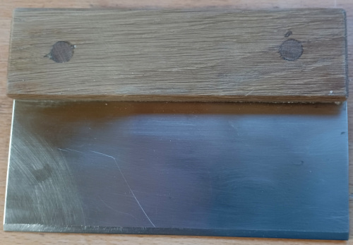

# Low-Tech Open Source Hardware

Ce dépot est une tentative de centraliser, de mutualiser et de diffuser des plans d'outils low-tech open-source hardware.

## Moyens utilisés

- Les plans doivent être sous format Freecad natif ([Freecad](https://www.freecad.org)). La version courante est la 0.21.1. Les mises en plan sont exportées sous format pdf.

- Les notices d'accompagnement, tutoriels et notices de montage doivent être sous format markdown ([Markdown](https://fr.wikipedia.org/wiki/Markdown)). Les exportations sous format pdf sont réalisées avec le logiciel pandoc ([Pandoc](https://pandoc.org/))

- La gestion de version est réalisée avec le logiciel git ([Git](https://git-scm.com/)). 

## Licenses utilisées

Sauf mention explicite contraire, tous les documents techniques sont sous license Creative Commons Attribution-ShareAlike 4.0 ou CC BY-SA 4.0 ([Creative Commons](https://creativecommons.org/)). Cela signifie que vous pouvez utiliser, modifier même pour des applications commerciales les documents tant que la license reste la même et que l'attribution à l'auteur original est faite.

## Outils pour la boulangerie

- [Petite spatule de boulanger](./small-baker-spatula/small-baker-spatula.pdf) : cette petite spatule peut être utilisée pendant toutes les opérations manuelles au pétrin

## Outils pour la meunerie